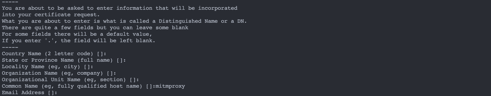
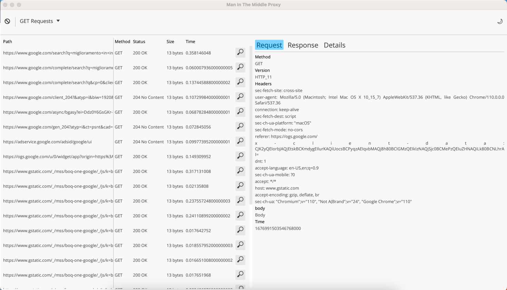
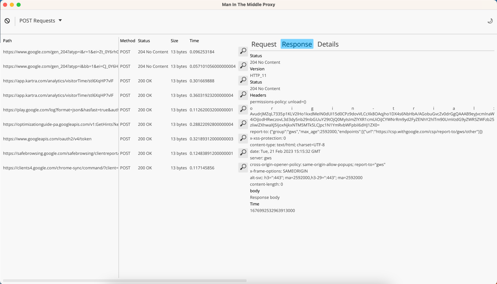
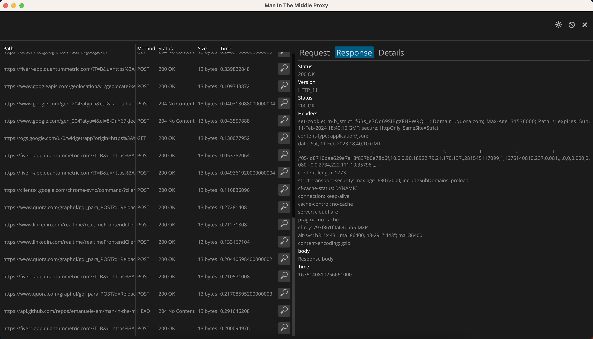
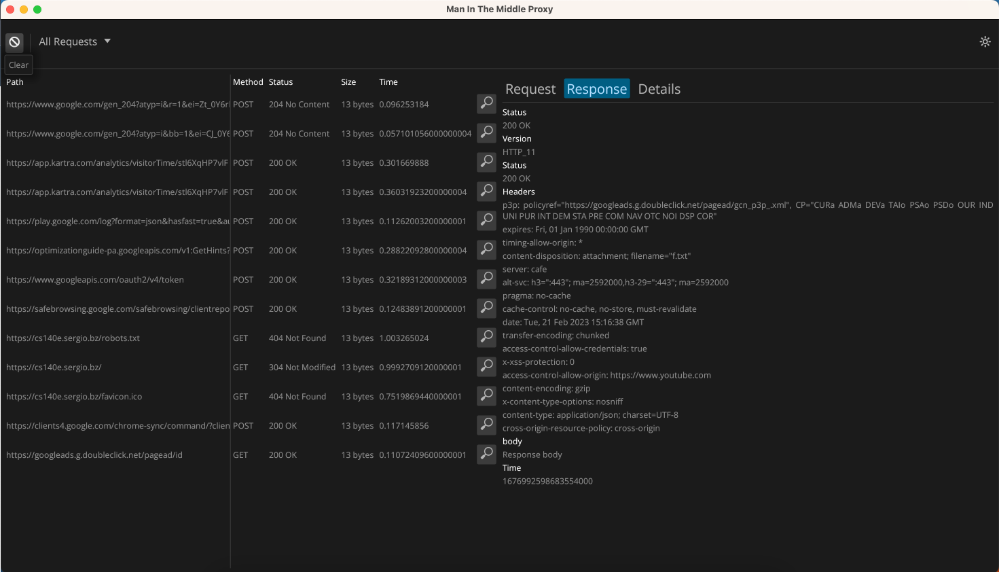

<h1> MITM Proxy </h1>

## Description
Rust-based **Man in the Middle proxy**, an early-stage project aimed at providing visibility into network traffic. Currently, it displays both HTTP and HTTPS requests and responses, but our future goal is to allow for manipulation of the traffic for more advanced use cases.

## Getting Started

1. Generate a Certificate:
  - go to `~proxyapi/src/ca/`
  - start generation with following terminal command: `openssl req -x509 -newkey rsa:4096 -keyout mitmproxy.key -out mitmproxy.cer -sha256 -days 700000 -nodes`
  - You can just hit `Enter` to accept default options but keep in mind to add at least a `common name`

  

2. Install `.cer` file locally and trust them.
  - [MacOS guide](https://support.apple.com/guide/keychain-access/change-the-trust-settings-of-a-certificate-kyca11871/mac#:~:text=In%20the%20Keychain%20Access%20app,from%20the%20pop%2Dup%20menus.)
  - [Ubuntu guide](https://ubuntu.com/server/docs/security-trust-store)
  - [Windows guide](https://learn.microsoft.com/en-us/skype-sdk/sdn/articles/installing-the-trusted-root-certificate)

3. Configure your local system proxy on `127.0.0.1:8100`.
  - [MacOS guide](https://support.apple.com/it-it/guide/mac-help/mchlp2591/mac)
  - [Ubuntu guide](https://help.ubuntu.com/stable/ubuntu-help/net-proxy.html.en)
  - [Windows guide](https://support.microsoft.com/en-us/windows/use-a-proxy-server-in-windows-03096c53-0554-4ffe-b6ab-8b1deee8dae1#:~:text=a%20VPN%20connection-,Select%20the%20Start%20button%2C%20then%20select%20Settings%20%3E%20Network%20%26%20Internet,information%20for%20that%20VPN%20connection.)

## Features and Roadmap

- [x]  Intercept HTTP requests and responses
- [x]  Inspect HTTP requests and responses
- [ ]  Modify HTTP requests 
- [x]  Intercept HTTPs requests and responses
- [x]  Inspect HTTPs requests and responses
- [ ]  Modify HTTPs requests 

## Contributing

Contributions are always welcome!

See `contributing.md` for ways to get started.

Please adhere to this project's `code of conduct`.

## Licenses

See [LICENSE-APACHE](LICENSE-APACHE), [LICENSE-MIT](LICENSE-MIT) for details
## Screenshots

